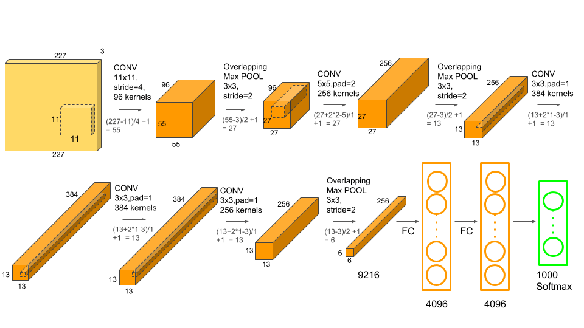

# AlexNet Implementation Step by step

I want to organize my understanding of Convolutional Neural Networks by implementing the AlexNet$^{[1]}​$. I would like to use TensorFlow as building blocks to practice programming skills. Image pre-process uses opencv library. 

## Model

The input image should be 227 pixels in height and width not 224.

Overall picture:



Detailed table:

| Name                           | oc   | ic   | H    | W    | Pading | Stride |
| ------------------------------ | ---- | ---- | ---- | ---- | ------ | ------ |
| Orig Image                     |      | 3    | any  | any  |        |        |
| cropped                        |      | 3    | 256  | 256  |        |        |
| input(random)                  |      | 3    | 227  | 227  |        |        |
| filter 1                       | 96   | 3    | 11   | 11   | 0      | 4      |
| activation 1_0(followed by RN) |      | 96   | 55   | 55   |        |        |
| maxpool1                       |      |      | 3    | 3    | 0      | 2      |
| activation 1_1                 |      | 96   | 27   | 27   |        |        |
| filter 2                       | 256  | 96   | 5    | 5    | 2      | 1      |
| activation 2_0(followed by RN) |      | 256  | 27   | 27   |        |        |
| maxpool 2                      |      |      | 3    | 3    | 0      | 2      |
| activation 2_1                 |      | 256  | 13   | 13   |        |        |
| filter 3                       | 384  | 256  | 3    | 3    | 1      | 1      |
| activation 3_0                 |      | 384  | 13   | 13   |        |        |
| filter 4                       | 384  | 384  | 3    | 3    | 1      | 1      |
| activation 4_0                 |      | 384  | 13   | 13   |        |        |
| filter5                        | 256  | 384  | 3    | 3    | 1      | 1      |
| activation 5_0                 |      | 256  | 13   | 13   |        |        |
| maxpool 5                      |      |      | 3    | 3    | 0      | 2      |
| activation 5_1                 |      | 256  | 6    | 6    |        |        |
| FC 6 (followed by dropout)     |      | 4096 |      |      |        |        |
| FC 7 (followed by dropout)     |      | 4096 |      |      |        |        |
| FC 8 & softmax                 |      | 1000 |      |      |        |        |


**Effect of Dropout**: mitigate overfitting because neurons on same(different) layer(s) can't just depend on the presence of particular other neurons, they must learn more robust features based on randomly appearance of other neurons, thus reduce the co-adaptations between neurons.

The more robust features are useful in conjunction with many different random subsets of the other neurons.

## Source Code

Source code includes 4 parts: 'data', 'inference', 'model', and 'training'.

Part 'data' is responsible for loading ImageNet images, preprocessing image, etc.

Part 'inference' is responsible for using trained model to make prediction.

Part 'model' is responsible for the definition of AlexNet.

Part 'training' is responsible for training configurations and model training.

## Tensorflow API

All the components with 'name' property from computation graph can be retrieved by 'name:0' when inferencing after trained model loaded. 

```python
# Inputs to computation graph are defined as placeholder: 
tf.placeholder
# Filters and Bias in conv layer are defined as trainable variables:
tf.get_variable
# Convolution computaions are defined as:
tf.nn.conv2d
# Bias computations are defined as:
tf.nn.bias_add
# Relu activations are defined as:
tf.nn.relu
# Max-pooling computations are defined as:
tf.nn.max_pool

# Flatten a multi-shaped convolution activation to a layer fitting for fully-connected component is defined as:
tf.contrib.layers.flatten
# Fully-connected layers are defined as:
tf.contrib.layers.fully_connected
# Dropout components are defined as:
tf.layers.dropout

# Objective(cost) in classification task for one training example is defined as cross-entropy between labels(One-hot) and logits(softmax):
tf.nn.softmax_cross_entropy_with_logits
# then objective of all training examples is defined:
tf.reduce_mean(...)

# Reset computation graph will clear all the tensors and computations in the graph, must be used in the beginning of graph definition:
tf.reset_default_graph
# Trainable variables in computation graph are needed initialization before training:
tf.global_variables_initializer
# Adam first-order gradient-based optimization for stochastic objective functions:
tf.train.AdamOptimizer

# After objective function, initializer and optimizer are defined, one must run them in a session:
with tf.Session() as sess:
    sess.run(init)
    for epoch in range(num_epochs):
        _, train_loss=sess.run([optimizer, cost], feed_dict)
# cost value is returned for convergency evaluation, if we want other metrics, just define those metrics in computation graph, then attach them to the [] slice in sess.run and assgin them in the left of "="

# Save model during training in case we need to mannually adjust hyper-parameters and after trained to reuse the model:
saver=tf.train.Saver  # define before session
saver.save(sess, filepath)  # save in session

# Load pretrained model when inference consists 2 steps in session:
# Step 1: import graph from meta file
saver=tf.train.import_meta_graph
# Step 2: restore the trained variables
saver.restore(sess, tf.train.latest_checkpoint(filepath))

# After pretrained model loaded, we want to inference that model:
# Step 1: get the computation graph handler:
graph=tf.get_default_graph()
# Step 2: retrive input tensors by name:
inputX = graph.get_tensor_by_name('inputX:0')
groundTruth = graph.get_tensor_by_name('groundTruth:0')
training = graph.get_tensor_by_name('training:0')
# Step 3: retrive prediction by name then find max probility's index:
prediction = graph.get_tensor_by_name('prediction:0')
max_prob_index=tf.argmax(input=prediction, axis=-1)
# Step 4: session run target max_prob_index with feeding input tensors:
feed_dict = {inputX: test_img, groundTruth: label, training: False}
result = sess.run(tf.argmax(input=prediction, axis=-1), feed_dict)
```


## Reference

[1]. @incollection{NIPS2012_4824,
title = {ImageNet Classification with Deep Convolutional Neural Networks},
author = {Alex Krizhevsky and Sutskever, Ilya and Hinton, Geoffrey E},
booktitle = {Advances in Neural Information Processing Systems 25},
editor = {F. Pereira and C. J. C. Burges and L. Bottou and K. Q. Weinberger},
pages = {1097--1105},
year = {2012},
publisher = {Curran Associates, Inc.},
url = {http://papers.nips.cc/paper/4824-imagenet-classification-with-deep-convolutional-neural-networks.pdf}
}

