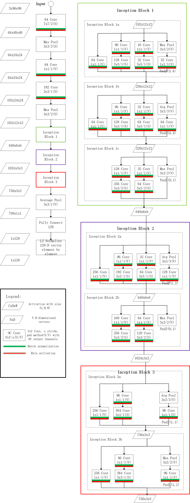

# FaceNet

The FaceNet model is used to encode a face crop image to a 128-dimensional vector, with which downstream applications could do face verification/recognition or face clustering.

# Model

FaceNet is based on GoogLeNet<sup>[1]</sup> whose performance is better than AlexNet on image classification. The main specialty that helps GoogLeNet out perform AlexNet is the deeper and wider network architecture it used. Through carefully designing, GoogLeNet introduced Inception blocks. To limit the explosion of filters, 1x1 convolution layers are pervasively used.

Please look at the figure 1 to have a glance at FaceNet.



<center>Figure 1. FaceNet Overview</center>

From figure 1 we can see, the layers before Inception are inspired by AlexNet: large sized filters interleaving with Max pools.

## Feed params

After defined the FaceNet forward process, I need to construct a dictionary to feed the trained parameters to model. That dictionary's key is tf.Variable from tf.get_default_graph, and value is trained parameters in .csv files. We can retrieve key by using graph.get_tensor_by_name, however, the fully connected layer hasn't a name attribute. To work around that, I printed all tf.global_variables to find what name is fully connected layer. As shown in below, fully connected layer parameters are with names: 'fully_connected/weights:0' and 'fully_connected/biases:0'.

print all tf.global_variables to find the variable name:

```python
for variable in tf.global_variables():
    print(variable)
```

result:

```python
<tf.Variable 'conv1_w:0' shape=(7, 7, 3, 64) dtype=float32_ref>
<tf.Variable 'conv1_b:0' shape=(64,) dtype=float32_ref>
<tf.Variable 'bn1_w:0' shape=(64,) dtype=float32_ref>
<tf.Variable 'bn1_b:0' shape=(64,) dtype=float32_ref>
<tf.Variable 'bn1_m:0' shape=(64,) dtype=float32_ref>
<tf.Variable 'bn1_v:0' shape=(64,) dtype=float32_ref>
<tf.Variable 'conv2_w:0' shape=(1, 1, 64, 64) dtype=float32_ref>
<tf.Variable 'conv2_b:0' shape=(64,) dtype=float32_ref>
<tf.Variable 'bn2_w:0' shape=(64,) dtype=float32_ref>
<tf.Variable 'bn2_b:0' shape=(64,) dtype=float32_ref>
<tf.Variable 'bn2_m:0' shape=(64,) dtype=float32_ref>
<tf.Variable 'bn2_v:0' shape=(64,) dtype=float32_ref>
<tf.Variable 'conv3_w:0' shape=(3, 3, 64, 192) dtype=float32_ref>
<tf.Variable 'conv3_b:0' shape=(192,) dtype=float32_ref>
<tf.Variable 'bn3_w:0' shape=(192,) dtype=float32_ref>
<tf.Variable 'bn3_b:0' shape=(192,) dtype=float32_ref>
<tf.Variable 'bn3_m:0' shape=(192,) dtype=float32_ref>
<tf.Variable 'bn3_v:0' shape=(192,) dtype=float32_ref>
<tf.Variable 'inception_3a_1x1_conv_w:0' shape=(1, 1, 192, 64) dtype=float32_ref>
<tf.Variable 'inception_3a_1x1_conv_b:0' shape=(64,) dtype=float32_ref>
<tf.Variable 'inception_3a_1x1_bn_w:0' shape=(64,) dtype=float32_ref>
<tf.Variable 'inception_3a_1x1_bn_b:0' shape=(64,) dtype=float32_ref>
<tf.Variable 'inception_3a_1x1_bn_m:0' shape=(64,) dtype=float32_ref>
<tf.Variable 'inception_3a_1x1_bn_v:0' shape=(64,) dtype=float32_ref>
<tf.Variable 'inception_3a_3x3_conv1_w:0' shape=(1, 1, 192, 96) dtype=float32_ref>
<tf.Variable 'inception_3a_3x3_conv1_b:0' shape=(96,) dtype=float32_ref>
<tf.Variable 'inception_3a_3x3_bn1_w:0' shape=(96,) dtype=float32_ref>
<tf.Variable 'inception_3a_3x3_bn1_b:0' shape=(96,) dtype=float32_ref>
<tf.Variable 'inception_3a_3x3_bn1_m:0' shape=(96,) dtype=float32_ref>
<tf.Variable 'inception_3a_3x3_bn1_v:0' shape=(96,) dtype=float32_ref>
<tf.Variable 'inception_3a_3x3_conv2_w:0' shape=(3, 3, 96, 128) dtype=float32_ref>
<tf.Variable 'inception_3a_3x3_conv2_b:0' shape=(128,) dtype=float32_ref>
<tf.Variable 'inception_3a_3x3_bn2_w:0' shape=(128,) dtype=float32_ref>
<tf.Variable 'inception_3a_3x3_bn2_b:0' shape=(128,) dtype=float32_ref>
<tf.Variable 'inception_3a_3x3_bn2_m:0' shape=(128,) dtype=float32_ref>
<tf.Variable 'inception_3a_3x3_bn2_v:0' shape=(128,) dtype=float32_ref>
<tf.Variable 'inception_3a_5x5_conv1_w:0' shape=(1, 1, 192, 16) dtype=float32_ref>
<tf.Variable 'inception_3a_5x5_conv1_b:0' shape=(16,) dtype=float32_ref>
<tf.Variable 'inception_3a_5x5_bn1_w:0' shape=(16,) dtype=float32_ref>
<tf.Variable 'inception_3a_5x5_bn1_b:0' shape=(16,) dtype=float32_ref>
<tf.Variable 'inception_3a_5x5_bn1_m:0' shape=(16,) dtype=float32_ref>
<tf.Variable 'inception_3a_5x5_bn1_v:0' shape=(16,) dtype=float32_ref>
<tf.Variable 'inception_3a_5x5_conv2_w:0' shape=(5, 5, 16, 32) dtype=float32_ref>
<tf.Variable 'inception_3a_5x5_conv2_b:0' shape=(32,) dtype=float32_ref>
<tf.Variable 'inception_3a_5x5_bn2_w:0' shape=(32,) dtype=float32_ref>
<tf.Variable 'inception_3a_5x5_bn2_b:0' shape=(32,) dtype=float32_ref>
<tf.Variable 'inception_3a_5x5_bn2_m:0' shape=(32,) dtype=float32_ref>
<tf.Variable 'inception_3a_5x5_bn2_v:0' shape=(32,) dtype=float32_ref>
<tf.Variable 'inception_3a_pool_conv_w:0' shape=(1, 1, 192, 32) dtype=float32_ref>
<tf.Variable 'inception_3a_pool_conv_b:0' shape=(32,) dtype=float32_ref>
<tf.Variable 'inception_3a_pool_bn_w:0' shape=(32,) dtype=float32_ref>
<tf.Variable 'inception_3a_pool_bn_b:0' shape=(32,) dtype=float32_ref>
<tf.Variable 'inception_3a_pool_bn_m:0' shape=(32,) dtype=float32_ref>
<tf.Variable 'inception_3a_pool_bn_v:0' shape=(32,) dtype=float32_ref>
<tf.Variable 'inception_3b_1x1_conv_w:0' shape=(1, 1, 256, 64) dtype=float32_ref>
<tf.Variable 'inception_3b_1x1_conv_b:0' shape=(64,) dtype=float32_ref>
<tf.Variable 'inception_3b_1x1_bn_w:0' shape=(64,) dtype=float32_ref>
<tf.Variable 'inception_3b_1x1_bn_b:0' shape=(64,) dtype=float32_ref>
<tf.Variable 'inception_3b_1x1_bn_m:0' shape=(64,) dtype=float32_ref>
<tf.Variable 'inception_3b_1x1_bn_v:0' shape=(64,) dtype=float32_ref>
<tf.Variable 'inception_3b_3x3_conv1_w:0' shape=(1, 1, 256, 96) dtype=float32_ref>
<tf.Variable 'inception_3b_3x3_conv1_b:0' shape=(96,) dtype=float32_ref>
<tf.Variable 'inception_3b_3x3_bn1_w:0' shape=(96,) dtype=float32_ref>
<tf.Variable 'inception_3b_3x3_bn1_b:0' shape=(96,) dtype=float32_ref>
<tf.Variable 'inception_3b_3x3_bn1_m:0' shape=(96,) dtype=float32_ref>
<tf.Variable 'inception_3b_3x3_bn1_v:0' shape=(96,) dtype=float32_ref>
<tf.Variable 'inception_3b_3x3_conv2_w:0' shape=(3, 3, 96, 128) dtype=float32_ref>
<tf.Variable 'inception_3b_3x3_conv2_b:0' shape=(128,) dtype=float32_ref>
<tf.Variable 'inception_3b_3x3_bn2_w:0' shape=(128,) dtype=float32_ref>
<tf.Variable 'inception_3b_3x3_bn2_b:0' shape=(128,) dtype=float32_ref>
<tf.Variable 'inception_3b_3x3_bn2_m:0' shape=(128,) dtype=float32_ref>
<tf.Variable 'inception_3b_3x3_bn2_v:0' shape=(128,) dtype=float32_ref>
<tf.Variable 'inception_3b_5x5_conv1_w:0' shape=(1, 1, 256, 32) dtype=float32_ref>
<tf.Variable 'inception_3b_5x5_conv1_b:0' shape=(32,) dtype=float32_ref>
<tf.Variable 'inception_3b_5x5_bn1_w:0' shape=(32,) dtype=float32_ref>
<tf.Variable 'inception_3b_5x5_bn1_b:0' shape=(32,) dtype=float32_ref>
<tf.Variable 'inception_3b_5x5_bn1_m:0' shape=(32,) dtype=float32_ref>
<tf.Variable 'inception_3b_5x5_bn1_v:0' shape=(32,) dtype=float32_ref>
<tf.Variable 'inception_3b_5x5_conv2_w:0' shape=(5, 5, 32, 64) dtype=float32_ref>
<tf.Variable 'inception_3b_5x5_conv2_b:0' shape=(64,) dtype=float32_ref>
<tf.Variable 'inception_3b_5x5_bn2_w:0' shape=(64,) dtype=float32_ref>
<tf.Variable 'inception_3b_5x5_bn2_b:0' shape=(64,) dtype=float32_ref>
<tf.Variable 'inception_3b_5x5_bn2_m:0' shape=(64,) dtype=float32_ref>
<tf.Variable 'inception_3b_5x5_bn2_v:0' shape=(64,) dtype=float32_ref>
<tf.Variable 'inception_3b_pool_conv_w:0' shape=(1, 1, 256, 64) dtype=float32_ref>
<tf.Variable 'inception_3b_pool_conv_b:0' shape=(64,) dtype=float32_ref>
<tf.Variable 'inception_3b_pool_bn_w:0' shape=(64,) dtype=float32_ref>
<tf.Variable 'inception_3b_pool_bn_b:0' shape=(64,) dtype=float32_ref>
<tf.Variable 'inception_3b_pool_bn_m:0' shape=(64,) dtype=float32_ref>
<tf.Variable 'inception_3b_pool_bn_v:0' shape=(64,) dtype=float32_ref>
<tf.Variable 'inception_3c_3x3_conv1_w:0' shape=(1, 1, 320, 128) dtype=float32_ref>
<tf.Variable 'inception_3c_3x3_conv1_b:0' shape=(128,) dtype=float32_ref>
<tf.Variable 'inception_3c_3x3_bn1_w:0' shape=(128,) dtype=float32_ref>
<tf.Variable 'inception_3c_3x3_bn1_b:0' shape=(128,) dtype=float32_ref>
<tf.Variable 'inception_3c_3x3_bn1_m:0' shape=(128,) dtype=float32_ref>
<tf.Variable 'inception_3c_3x3_bn1_v:0' shape=(128,) dtype=float32_ref>
<tf.Variable 'inception_3c_3x3_conv2_w:0' shape=(3, 3, 128, 256) dtype=float32_ref>
<tf.Variable 'inception_3c_3x3_conv2_b:0' shape=(256,) dtype=float32_ref>
<tf.Variable 'inception_3c_3x3_bn2_w:0' shape=(256,) dtype=float32_ref>
<tf.Variable 'inception_3c_3x3_bn2_b:0' shape=(256,) dtype=float32_ref>
<tf.Variable 'inception_3c_3x3_bn2_m:0' shape=(256,) dtype=float32_ref>
<tf.Variable 'inception_3c_3x3_bn2_v:0' shape=(256,) dtype=float32_ref>
<tf.Variable 'inception_3c_5x5_conv1_w:0' shape=(1, 1, 320, 32) dtype=float32_ref>
<tf.Variable 'inception_3c_5x5_conv1_b:0' shape=(32,) dtype=float32_ref>
<tf.Variable 'inception_3c_5x5_bn1_w:0' shape=(32,) dtype=float32_ref>
<tf.Variable 'inception_3c_5x5_bn1_b:0' shape=(32,) dtype=float32_ref>
<tf.Variable 'inception_3c_5x5_bn1_m:0' shape=(32,) dtype=float32_ref>
<tf.Variable 'inception_3c_5x5_bn1_v:0' shape=(32,) dtype=float32_ref>
<tf.Variable 'inception_3c_5x5_conv2_w:0' shape=(5, 5, 32, 64) dtype=float32_ref>
<tf.Variable 'inception_3c_5x5_conv2_b:0' shape=(64,) dtype=float32_ref>
<tf.Variable 'inception_3c_5x5_bn2_w:0' shape=(64,) dtype=float32_ref>
<tf.Variable 'inception_3c_5x5_bn2_b:0' shape=(64,) dtype=float32_ref>
<tf.Variable 'inception_3c_5x5_bn2_m:0' shape=(64,) dtype=float32_ref>
<tf.Variable 'inception_3c_5x5_bn2_v:0' shape=(64,) dtype=float32_ref>
<tf.Variable 'inception_4a_1x1_conv_w:0' shape=(1, 1, 640, 256) dtype=float32_ref>
<tf.Variable 'inception_4a_1x1_conv_b:0' shape=(256,) dtype=float32_ref>
<tf.Variable 'inception_4a_1x1_bn_w:0' shape=(256,) dtype=float32_ref>
<tf.Variable 'inception_4a_1x1_bn_b:0' shape=(256,) dtype=float32_ref>
<tf.Variable 'inception_4a_1x1_bn_m:0' shape=(256,) dtype=float32_ref>
<tf.Variable 'inception_4a_1x1_bn_v:0' shape=(256,) dtype=float32_ref>
<tf.Variable 'inception_4a_3x3_conv1_w:0' shape=(1, 1, 640, 96) dtype=float32_ref>
<tf.Variable 'inception_4a_3x3_conv1_b:0' shape=(96,) dtype=float32_ref>
<tf.Variable 'inception_4a_3x3_bn1_w:0' shape=(96,) dtype=float32_ref>
<tf.Variable 'inception_4a_3x3_bn1_b:0' shape=(96,) dtype=float32_ref>
<tf.Variable 'inception_4a_3x3_bn1_m:0' shape=(96,) dtype=float32_ref>
<tf.Variable 'inception_4a_3x3_bn1_v:0' shape=(96,) dtype=float32_ref>
<tf.Variable 'inception_4a_3x3_conv2_w:0' shape=(3, 3, 96, 192) dtype=float32_ref>
<tf.Variable 'inception_4a_3x3_conv2_b:0' shape=(192,) dtype=float32_ref>
<tf.Variable 'inception_4a_3x3_bn2_w:0' shape=(192,) dtype=float32_ref>
<tf.Variable 'inception_4a_3x3_bn2_b:0' shape=(192,) dtype=float32_ref>
<tf.Variable 'inception_4a_3x3_bn2_m:0' shape=(192,) dtype=float32_ref>
<tf.Variable 'inception_4a_3x3_bn2_v:0' shape=(192,) dtype=float32_ref>
<tf.Variable 'inception_4a_5x5_conv1_w:0' shape=(1, 1, 640, 32) dtype=float32_ref>
<tf.Variable 'inception_4a_5x5_conv1_b:0' shape=(32,) dtype=float32_ref>
<tf.Variable 'inception_4a_5x5_bn1_w:0' shape=(32,) dtype=float32_ref>
<tf.Variable 'inception_4a_5x5_bn1_b:0' shape=(32,) dtype=float32_ref>
<tf.Variable 'inception_4a_5x5_bn1_m:0' shape=(32,) dtype=float32_ref>
<tf.Variable 'inception_4a_5x5_bn1_v:0' shape=(32,) dtype=float32_ref>
<tf.Variable 'inception_4a_5x5_conv2_w:0' shape=(5, 5, 32, 64) dtype=float32_ref>
<tf.Variable 'inception_4a_5x5_conv2_b:0' shape=(64,) dtype=float32_ref>
<tf.Variable 'inception_4a_5x5_bn2_w:0' shape=(64,) dtype=float32_ref>
<tf.Variable 'inception_4a_5x5_bn2_b:0' shape=(64,) dtype=float32_ref>
<tf.Variable 'inception_4a_5x5_bn2_m:0' shape=(64,) dtype=float32_ref>
<tf.Variable 'inception_4a_5x5_bn2_v:0' shape=(64,) dtype=float32_ref>
<tf.Variable 'inception_4a_pool_conv_w:0' shape=(1, 1, 640, 128) dtype=float32_ref>
<tf.Variable 'inception_4a_pool_conv_b:0' shape=(128,) dtype=float32_ref>
<tf.Variable 'inception_4a_pool_bn_w:0' shape=(128,) dtype=float32_ref>
<tf.Variable 'inception_4a_pool_bn_b:0' shape=(128,) dtype=float32_ref>
<tf.Variable 'inception_4a_pool_bn_m:0' shape=(128,) dtype=float32_ref>
<tf.Variable 'inception_4a_pool_bn_v:0' shape=(128,) dtype=float32_ref>
<tf.Variable 'inception_4e_3x3_conv1_w:0' shape=(1, 1, 640, 160) dtype=float32_ref>
<tf.Variable 'inception_4e_3x3_conv1_b:0' shape=(160,) dtype=float32_ref>
<tf.Variable 'inception_4e_3x3_bn1_w:0' shape=(160,) dtype=float32_ref>
<tf.Variable 'inception_4e_3x3_bn1_b:0' shape=(160,) dtype=float32_ref>
<tf.Variable 'inception_4e_3x3_bn1_m:0' shape=(160,) dtype=float32_ref>
<tf.Variable 'inception_4e_3x3_bn1_v:0' shape=(160,) dtype=float32_ref>
<tf.Variable 'inception_4e_3x3_conv2_w:0' shape=(3, 3, 160, 256) dtype=float32_ref>
<tf.Variable 'inception_4e_3x3_conv2_b:0' shape=(256,) dtype=float32_ref>
<tf.Variable 'inception_4e_3x3_bn2_w:0' shape=(256,) dtype=float32_ref>
<tf.Variable 'inception_4e_3x3_bn2_b:0' shape=(256,) dtype=float32_ref>
<tf.Variable 'inception_4e_3x3_bn2_m:0' shape=(256,) dtype=float32_ref>
<tf.Variable 'inception_4e_3x3_bn2_v:0' shape=(256,) dtype=float32_ref>
<tf.Variable 'inception_4e_5x5_conv1_w:0' shape=(1, 1, 640, 64) dtype=float32_ref>
<tf.Variable 'inception_4e_5x5_conv1_b:0' shape=(64,) dtype=float32_ref>
<tf.Variable 'inception_4e_5x5_bn1_w:0' shape=(64,) dtype=float32_ref>
<tf.Variable 'inception_4e_5x5_bn1_b:0' shape=(64,) dtype=float32_ref>
<tf.Variable 'inception_4e_5x5_bn1_m:0' shape=(64,) dtype=float32_ref>
<tf.Variable 'inception_4e_5x5_bn1_v:0' shape=(64,) dtype=float32_ref>
<tf.Variable 'inception_4e_5x5_conv2_w:0' shape=(5, 5, 64, 128) dtype=float32_ref>
<tf.Variable 'inception_4e_5x5_conv2_b:0' shape=(128,) dtype=float32_ref>
<tf.Variable 'inception_4e_5x5_bn2_w:0' shape=(128,) dtype=float32_ref>
<tf.Variable 'inception_4e_5x5_bn2_b:0' shape=(128,) dtype=float32_ref>
<tf.Variable 'inception_4e_5x5_bn2_m:0' shape=(128,) dtype=float32_ref>
<tf.Variable 'inception_4e_5x5_bn2_v:0' shape=(128,) dtype=float32_ref>
<tf.Variable 'inception_5a_1x1_conv_w:0' shape=(1, 1, 1024, 256) dtype=float32_ref>
<tf.Variable 'inception_5a_1x1_conv_b:0' shape=(256,) dtype=float32_ref>
<tf.Variable 'inception_5a_1x1_bn_w:0' shape=(256,) dtype=float32_ref>
<tf.Variable 'inception_5a_1x1_bn_b:0' shape=(256,) dtype=float32_ref>
<tf.Variable 'inception_5a_1x1_bn_m:0' shape=(256,) dtype=float32_ref>
<tf.Variable 'inception_5a_1x1_bn_v:0' shape=(256,) dtype=float32_ref>
<tf.Variable 'inception_5a_3x3_conv1_w:0' shape=(1, 1, 1024, 96) dtype=float32_ref>
<tf.Variable 'inception_5a_3x3_conv1_b:0' shape=(96,) dtype=float32_ref>
<tf.Variable 'inception_5a_3x3_bn1_w:0' shape=(96,) dtype=float32_ref>
<tf.Variable 'inception_5a_3x3_bn1_b:0' shape=(96,) dtype=float32_ref>
<tf.Variable 'inception_5a_3x3_bn1_m:0' shape=(96,) dtype=float32_ref>
<tf.Variable 'inception_5a_3x3_bn1_v:0' shape=(96,) dtype=float32_ref>
<tf.Variable 'inception_5a_3x3_conv2_w:0' shape=(3, 3, 96, 384) dtype=float32_ref>
<tf.Variable 'inception_5a_3x3_conv2_b:0' shape=(384,) dtype=float32_ref>
<tf.Variable 'inception_5a_3x3_bn2_w:0' shape=(384,) dtype=float32_ref>
<tf.Variable 'inception_5a_3x3_bn2_b:0' shape=(384,) dtype=float32_ref>
<tf.Variable 'inception_5a_3x3_bn2_m:0' shape=(384,) dtype=float32_ref>
<tf.Variable 'inception_5a_3x3_bn2_v:0' shape=(384,) dtype=float32_ref>
<tf.Variable 'inception_5a_pool_conv_w:0' shape=(1, 1, 1024, 96) dtype=float32_ref>
<tf.Variable 'inception_5a_pool_conv_b:0' shape=(96,) dtype=float32_ref>
<tf.Variable 'inception_5a_pool_bn_w:0' shape=(96,) dtype=float32_ref>
<tf.Variable 'inception_5a_pool_bn_b:0' shape=(96,) dtype=float32_ref>
<tf.Variable 'inception_5a_pool_bn_m:0' shape=(96,) dtype=float32_ref>
<tf.Variable 'inception_5a_pool_bn_v:0' shape=(96,) dtype=float32_ref>
<tf.Variable 'inception_5b_1x1_conv_w:0' shape=(1, 1, 736, 256) dtype=float32_ref>
<tf.Variable 'inception_5b_1x1_conv_b:0' shape=(256,) dtype=float32_ref>
<tf.Variable 'inception_5b_1x1_bn_w:0' shape=(256,) dtype=float32_ref>
<tf.Variable 'inception_5b_1x1_bn_b:0' shape=(256,) dtype=float32_ref>
<tf.Variable 'inception_5b_1x1_bn_m:0' shape=(256,) dtype=float32_ref>
<tf.Variable 'inception_5b_1x1_bn_v:0' shape=(256,) dtype=float32_ref>
<tf.Variable 'inception_5b_3x3_conv1_w:0' shape=(1, 1, 736, 96) dtype=float32_ref>
<tf.Variable 'inception_5b_3x3_conv1_b:0' shape=(96,) dtype=float32_ref>
<tf.Variable 'inception_5b_3x3_bn1_w:0' shape=(96,) dtype=float32_ref>
<tf.Variable 'inception_5b_3x3_bn1_b:0' shape=(96,) dtype=float32_ref>
<tf.Variable 'inception_5b_3x3_bn1_m:0' shape=(96,) dtype=float32_ref>
<tf.Variable 'inception_5b_3x3_bn1_v:0' shape=(96,) dtype=float32_ref>
<tf.Variable 'inception_5b_3x3_conv2_w:0' shape=(3, 3, 96, 384) dtype=float32_ref>
<tf.Variable 'inception_5b_3x3_conv2_b:0' shape=(384,) dtype=float32_ref>
<tf.Variable 'inception_5b_3x3_bn2_w:0' shape=(384,) dtype=float32_ref>
<tf.Variable 'inception_5b_3x3_bn2_b:0' shape=(384,) dtype=float32_ref>
<tf.Variable 'inception_5b_3x3_bn2_m:0' shape=(384,) dtype=float32_ref>
<tf.Variable 'inception_5b_3x3_bn2_v:0' shape=(384,) dtype=float32_ref>
<tf.Variable 'inception_5b_pool_conv_w:0' shape=(1, 1, 736, 96) dtype=float32_ref>
<tf.Variable 'inception_5b_pool_conv_b:0' shape=(96,) dtype=float32_ref>
<tf.Variable 'inception_5b_pool_bn_w:0' shape=(96,) dtype=float32_ref>
<tf.Variable 'inception_5b_pool_bn_b:0' shape=(96,) dtype=float32_ref>
<tf.Variable 'inception_5b_pool_bn_m:0' shape=(96,) dtype=float32_ref>
<tf.Variable 'inception_5b_pool_bn_v:0' shape=(96,) dtype=float32_ref>
<tf.Variable 'fully_connected/weights:0' shape=(736, 128) dtype=float32_ref>
<tf.Variable 'fully_connected/biases:0' shape=(128,) dtype=float32_ref>
```

## Debug

1. tf.nn.conv2d(padding='SAME', ...) does **not** necessarily pad zeros symmetrically, which lead to the inconsistence between tensorflow impl. and orignal keras impl. To solve this problem, use tf.pad explicitly to pad the convolution inputs.

2. For trained network, batchnormalization layer has 4 kinds of params: gamma, beta, mean, variance. They are used to normalize the convolution result on the channel dimension per batch. The sequence of those params are: 

   ```python
   tf.nn.batch_normalization(x=input, variance_epsilon=epsilon, mean=bn_mean, variance=bn_variance, offset=bn_beta, scale=bn_gamma, name=name)
   ```

## Save model

After correctly inferencing the face vector in tensorflow, a question comes out: Can we save the model so that restore the model to inference rather than load the parameters from csv.

The answer is yes, and consuming time is reduced largely. The code corresponding to that is src/inference/\_\_init\_\_.py

Since the variables in the compute graph are loaded from csv. files not trained, we must save these variables explicitly using sess.run

```python
saver = tf.train.Saver()
var_fc_w = [v for v in tf.global_variables() if v.name == 'fully_connected/weights:0'][0]
param_fc_w = loadfromcsv(path)
...
sess.run(var_fc_w.assign(param_fc_w))
...
saver.save(sess, '../../model/face_encoding.ckpt')
```

Then the whole compute graph can be saved in model files, which can be restored in later inference tasks.

## Server model

The next step is to turn the saved model into server model to facilitate the on-line use.

